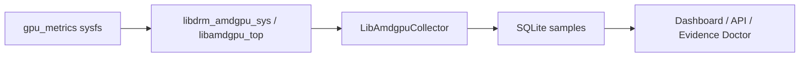

# PROCHOT_CPU / PROCHOT_GPU investigation

This document records a deep dive into why framelog can show **PROCHOT_CPU** and **PROCHOT_GPU** at **100% active** on Framework AMD laptops (Radeon 780M / Phoenix), and what that means for interpretation.

## Short answer

| Question | Answer |
|----------|--------|
| Are the dashboard/API numbers wrong? | **No** — they faithfully reflect what the AMDGPU `gpu_metrics` path reports after library decoding. |
| Does 100% PROCHOT mean your CPU/GPU are in constant emergency thermal throttle? | **Not necessarily** — on `gpu_metrics` **v2.1**, PROCHOT often comes from **legacy `throttle_status` bits 9 and 10** that can appear **stuck on** without matching EC/firmware PROCHOT or obvious thermal crisis. |
| Should you panic? | **No** — treat always-on PROCHOT as a **suspect signal** until corroborated by sustained high core temperature, low clocks under load, or external tools (EC, `amd-smi`, performance). |

## What PROCHOT means

**PROCHOT** (processor hot) is a hardware/firmware **emergency thermal throttle** indication. In AMD’s independent throttle model (`amdgpu_smu.h`), `PROCHOT_CPU` and `PROCHOT_GPU` sit in the **temperature** throttler family (bits 46 and 47 in the 64-bit independent mask).

AMD’s documentation and tools describe non-zero PROCHOT-related bits as “throttling is happening **right now**” for that reason — not as a duty cycle or historical counter.

## Data path in framelog



Relevant code:

- Collection: [`src/collector.rs`](../src/collector.rs) — `get_indep_throttle_status()` with fallback to `get_indep_throttle_status_without_check()`
- Flag names: [`src/throttle.rs`](../src/throttle.rs) — `active_flags(indep_throttle_status)`
- Storage: `samples.indep_throttle_status`, `samples.throttle_status_raw`, `samples.active_flags`
- Charts: `/api/series/{flag}` decodes the stored **mask** per sample
- Summaries: `flag_activity` from `active_flags` JSON

Raw values are **preserved**; framelog does not clear or rewrite PROCHOT bits.

## Two different throttle representations

AMD evolved `gpu_metrics` over time:

1. **Legacy ASIC-dependent `throttle_status` (u32)** — bit layout defined per SMU firmware interface (e.g. Yellow Carp / SMU13: bits 9 and 10 are `PROCHOT_CPU` and `PROCHOT_GFX`).
2. **Independent `indep_throttle_status` (u64)** — ASIC-independent layout in `amdgpu_smu.h` (PROCHOT at bits 46 and 47).

On **`gpu_metrics_v2_1`** (common on Radeon 780M), the kernel table often has **only** legacy `throttle_status`. The Rust library **synthesizes** `indep_throttle_status` by mapping legacy bits into the independent enum positions (see `libdrm_amdgpu_sys` `gpu_metrics_v2_1::get_indep_throttle_status`).

On **`gpu_metrics_v2_2+`**, the driver exposes a native `indep_throttle_status` field; mapping workarounds are less central.

framelog records `extra_json.throttle_source`:

- `indep_throttle_status` — native 64-bit field read from metrics
- `legacy_throttle_status_mapped` — independent mask derived from legacy `throttle_status`
- `none` — no throttle data

## Live observations (this machine)

Example from `framelog inspect --collector lib-amdgpu` on AMD Radeon 780M (device `0x15bf`, PCI `0000:c1:00.0`):

| Field | Value | Meaning |
|-------|-------|---------|
| `throttle_status_raw` | **1536** | `0x600` = bit 9 + bit 10 only |
| `active_flags` | `PROCHOT_CPU`, `PROCHOT_GPU` | Mapped to independent bits 46 and 47 |
| `indep_throttle_status` | `211106232532992` | `0xC00000000000` |
| PROCHOT transitions (1 h window) | **0 assert / 0 clear** | Sticky — never toggles in DB |
| `active_sample_pct` | **100%** for both PROCHOT flags | Every sample in window |
| Package power | ~27–62 W max in window | Not a flatlined emergency profile |
| Core temp | ~60–106 °C max in window | Can be warm; not always “idle cool” |

**1536** is the smoking gun for the legacy path: it is exactly Yellow Carp’s legacy PROCHOT bit pair, not a random decode error.

## Why this is scary but often misleading

1. **Sticky bits** — If PROCHOT never asserts/clears in `transitions` but is always on in `samples`, you are likely seeing a **firmware/driver reporting quirk**, not a repeating thermal event stream.
2. **Framework community reports** — Users have seen `amdgpu_top` report `[PROCHOT_CPU, PROCHOT_GPU]` while EC-level PROCHOT tooling reports none ([Framework community thread](https://community.frame.work/t/amdgpu-top-throttle-status/68954)).
3. **Similar HOTSPOT issues** — AMD issue [#3251](https://gitlab.freedesktop.org/drm/amd/-/issues/3251) documents `TEMP_HOTSPOT` appearing stuck in `gpu_metrics` on some GPUs; PROCHOT on APUs may be analogous.
4. **Evidence Doctor** — If PROCHOT counts toward “thermal dominant” at 100%, analysis can over-weight thermal limiting. framelog now treats **suspect sticky legacy PROCHOT** separately (see below).

## What *would* indicate real PROCHOT

Trust PROCHOT more when several agree:

- PROCHOT **toggles** with load/temperature (assert/clear transitions in timeline)
- **TEMP_CORE** / **TEMP_HOTSPOT** also active, or sustained very high `temperature_core_max` (e.g. near platform limits under load)
- **Clocks collapse** and power drops during the same windows (compare gfx/core clocks if you add them later)
- External corroboration: EC PROCHOT, `amd-smi metric --power`, or obvious performance loss

## How to verify on your system

```bash
# One-shot sample (JSON includes throttle_source in extra_json)
framelog inspect --collector lib-amdgpu | jq '.samples[0] | {throttle_status_raw, indep_throttle_status, active_flags, temperature_core_max, extra_json}'

# Compare with amdgpu_top if installed
amdgpu_top -J -gm -n 1 --select-apu | jq '.[] | .gpu_metrics | {throttle_status, indep_throttle_status}'
```

Read raw metrics (path varies by PCI):

```bash
find /sys/devices -path '*/drm/card*/device/gpu_metrics' 2>/dev/null
```

Check kernel/driver versions in **System reference** in the UI or `framelog capabilities`.

## framelog behavior after this investigation

1. **Documentation** — this file.
2. **Collector metadata** — `extra_json.throttle_source` records how the independent mask was obtained.
3. **Suspect detection** — [`src/throttle.rs`](../src/throttle.rs) `prochot_suspect_sticky_legacy()` for analysis and summary warnings.
4. **Evidence Doctor** — finding `prochot_suspect_legacy_status` (info): explains sticky legacy PROCHOT; does not replace thermal findings when temperature evidence is strong.
5. **Dashboard** — warning banner when PROCHOT is 100% active with zero transitions.

## Recommended user action

1. **Do not assume hardware damage** from dashboard PROCHOT alone.
2. **Check real symptoms**: games/apps stuttering, sustained fans, thermal paste, dust, power profile.
3. **Watch SPL/SPPT/FPPT and package power** — Framework #146 debugging often cares more about package power caps than PROCHOT on 780M.
4. **File upstream** if sticky `throttle_status == 1536` persists across kernel updates with normal thermals — include `framelog inspect` JSON and this doc.

## References

- Kernel Yellow Carp metrics: `smu13_driver_if_yellow_carp.h` — `THROTTLER_STATUS_BIT_PROCHOT_CPU` (9), `PROCHOT_GFX` (10)
- Independent throttlers: `drivers/gpu/drm/amd/pm/swsmu/inc/amdgpu_smu.h`
- `libdrm_amdgpu_sys` `gpu_metrics_v2_1::get_indep_throttle_status` — legacy bit mapping
- [AMD GPU violations / throttle_status (AMD SMI)](https://rocm.docs.amd.com/projects/amdsmi/en/develop/conceptual/gpu-violations.html)
- [Framework amdgpu_top PROCHOT discussion](https://community.frame.work/t/amdgpu-top-throttle-status/68954)
- [AMD gitlab #3251 — TEMP_HOTSPOT stuck in gpu_metrics](https://gitlab.freedesktop.org/drm/amd/-/issues/3251)
